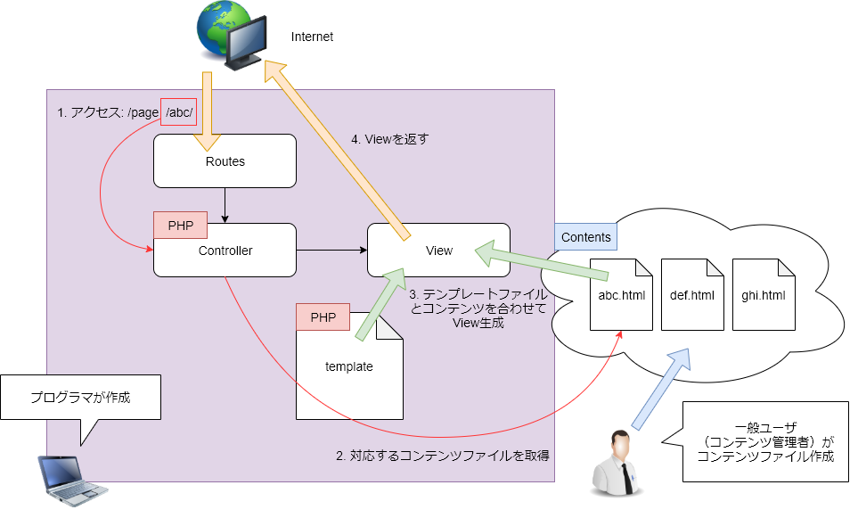

# ini_html

htmlコンテンツをテンプレートファイルと別ファイル（別サーバ）で管理するときのメタ情報埋め込み手法

## What's this?

以下のような形で簡易的なCMS（コンテンツ・マネジメント・システム）を作る場合の話



***

## What's Problem?

コンテンツHTMLファイルに、メタ情報（title, description 等）をどのように持たせるかが問題

### PHPを埋め込む
以下のようにPHPを埋め込んでしまうのが一番簡単

```php
<?php
/* メタ情報を定義 */
$title = 'タイトル';
$description = 'ページの説明';
$keywords = ['html', 'php', 'cms'];
?>
<!-- 以下コンテンツ -->
<div class="container">
    <h1>タイトル</h1>
    <p>...</p>
</div>
```

### PHP埋め込みでは何が問題か？
任意のコードを記述できるため、危険なPHPコードが実行される危険性がある

***

## 解決策

コンテンツHTMLファイルの中でメタ情報を記述するためのドメイン特化言語（という名の ini 文字列）を作成する

```html
<!-- 以下のメタ情報は実際には表示されない -->
::meta::
    title = "タイトル"
    description = "ページの説明"
    keywords[] = "html"
    keywords[] = "php"
    keywords[] = "cms"
::end::
<!-- 以下コンテンツ -->
<div class="container">
    <h1>タイトル</h1>
    <p>...</p>
</div>
```
